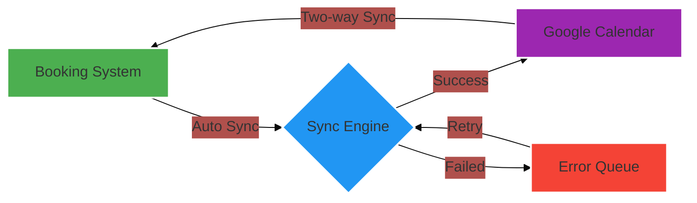
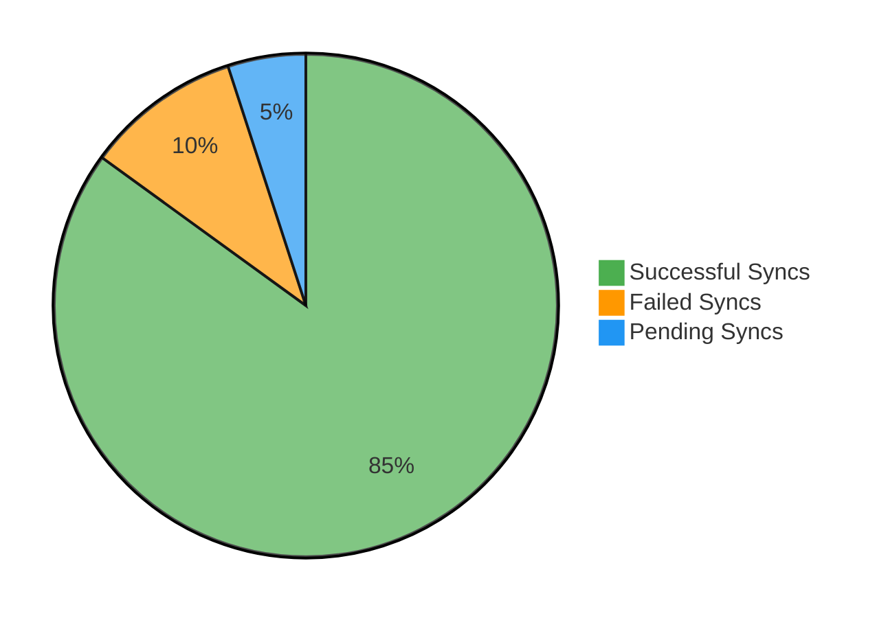
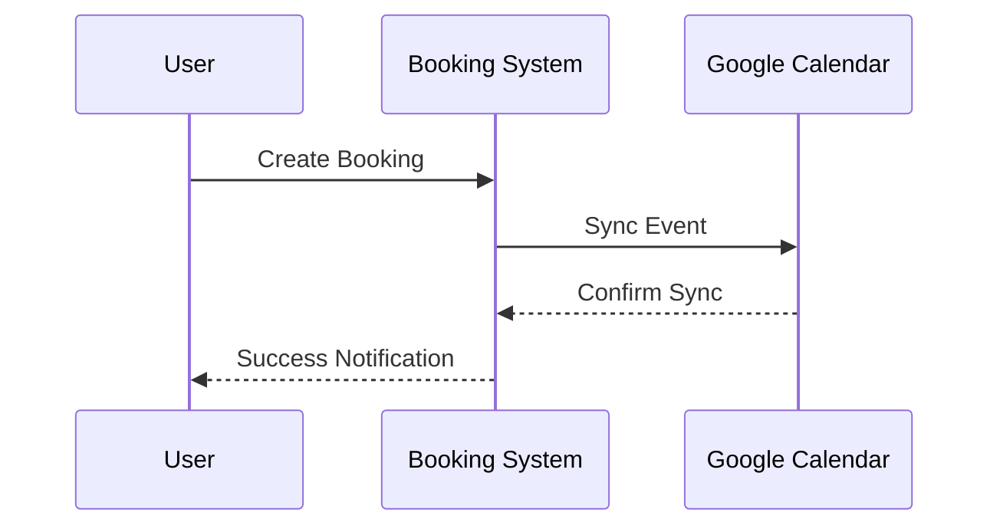
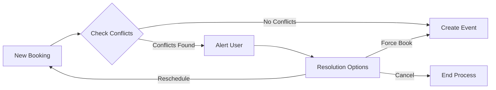
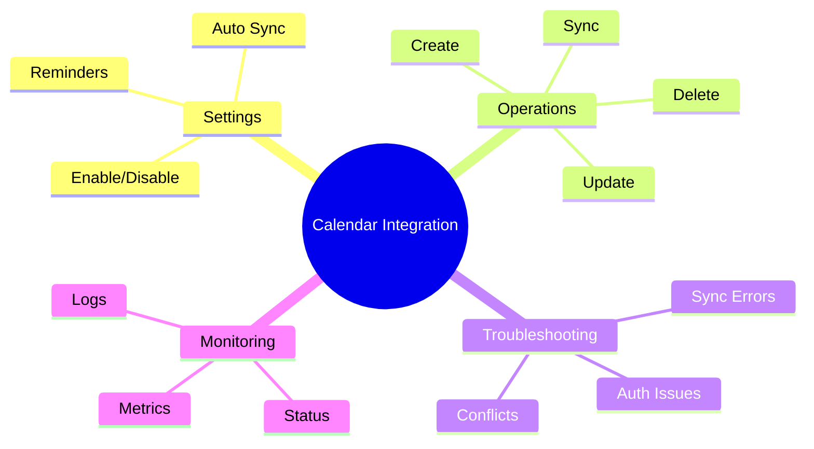

# Google Calendar Integration Dashboard

<div class="dashboard-container">
    <div class="dashboard-header">
        <div class="title-section">
            <h1>📅 Calendar Integration Analytics</h1>
            <p class="last-updated">Last updated: Nov 1, 2025 15:30 UTC</p>
        </div>
        
        <div class="filter-section">
            <div class="date-range-picker">
                <label>Time Range:</label>
                <select>
                    <option>Last 24 Hours</option>
                    <option>Last 7 Days</option>
                    <option>Last 30 Days</option>
                    <option>Custom Range</option>
                </select>
            </div>
            
            <div class="view-options">
                <button class="active">Overview</button>
                <button>Detailed</button>
                <button>Reports</button>
            </div>
        </div>
    </div>

## 📊 Performance Overview

<div class="metrics-grid">

<div class="metric-cards">
    <div class="metric-card success">
        <div class="metric-header">
            <h3>Sync Success Rate</h3>
            <span class="trend up">↑ 2.3%</span>
        </div>
        <div class="metric-value">98.5%</div>
        <div class="sparkline">
            █▆█████▆█
        </div>
    </div>
    
    <div class="metric-card info">
        <div class="metric-header">
            <h3>Average Sync Time</h3>
            <span class="trend down">↓ 0.3s</span>
        </div>
        <div class="metric-value">1.2s</div>
        <div class="sparkline">
            ▁▂▃▅█▇▆▅▄▃
        </div>
    </div>
    
    <div class="metric-card warning">
        <div class="metric-header">
            <h3>Active Users</h3>
            <span class="trend up">↑ 156</span>
        </div>
        <div class="metric-value">1,245</div>
        <div class="sparkline">
            ▃▅▆█████▆▅
        </div>
    </div>
    
    <div class="metric-card primary">
        <div class="metric-header">
            <h3>Events Synced/Day</h3>
            <span class="trend up">↑ 420</span>
        </div>
        <div class="metric-value">3,890</div>
        <div class="sparkline">
            ▅▆▇███▇▆▅▄
        </div>
    </div>
</div>

<style>
.metric-cards {
    display: grid;
    grid-template-columns: repeat(auto-fit, minmax(250px, 1fr));
    gap: 20px;
    margin: 20px 0;
}

.metric-card {
    padding: 20px;
    border-radius: 10px;
    box-shadow: 0 2px 8px rgba(0,0,0,0.1);
    transition: transform 0.2s;
}

.metric-card:hover {
    transform: translateY(-5px);
}

.metric-header {
    display: flex;
    justify-content: space-between;
    align-items: center;
    margin-bottom: 10px;
}

.metric-value {
    font-size: 32px;
    font-weight: bold;
    margin: 15px 0;
}

.trend {
    padding: 4px 8px;
    border-radius: 15px;
    font-size: 14px;
}

.trend.up {
    background-color: #E8F5E9;
    color: #4CAF50;
}

.trend.down {
    background-color: #FFEBEE;
    color: #F44336;
}

.sparkline {
    font-family: monospace;
    letter-spacing: 2px;
    color: #666;
}

.success { background-color: #F1F8E9; }
.info { background-color: #E1F5FE; }
.warning { background-color: #FFF3E0; }
.primary { background-color: #E8EAF6; }
</style>

## 🎯 System Overview

:::info
The system provides seamless two-way synchronization between our booking system and users' Google Calendars, offering real-time updates and conflict detection.
:::

<div class="grid-container" style="display: grid; grid-template-columns: repeat(3, 1fr); gap: 20px; margin: 20px 0;">

<div class="card">
<h3>🔄 Sync Status</h3>
<p>Real-time monitoring</p>
<p>Auto-recovery system</p>
<p>Conflict resolution</p>
</div>

<div class="card">
<h3>🔐 Security</h3>
<p>OAuth2 authentication</p>
<p>Encrypted data transfer</p>
<p>Access control</p>
</div>

<div class="card">
<h3>⚡ Performance</h3>
<p>Sub-second sync</p>
<p>Batch processing</p>
<p>Load balancing</p>
</div>

</div>

## 📈 Features & Capabilities

### 1. Google Calendar Synchronization
- **Two-way Sync**: Events are synchronized bidirectionally between the booking system and Google Calendar
- **Auto-sync**: Automatic synchronization when creating, updating, or deleting bookings
- **Manual Sync**: Users can manually trigger synchronization when needed
- **Conflict Detection**: System checks for conflicts with existing Google Calendar events

### 2. Configuration Settings
- `googleCalendarEnabled`: Master toggle for Google Calendar integration
- `googleCalendarAutoSync`: Controls automatic synchronization
- `googleCalendarDefaultReminder`: Sets default reminder time for events
- `googleCalendarSyncPeriod`: Determines how far back/forward to sync events

## Technical Implementation

### Authentication
```javascript
// Authentication is handled through Google OAuth2
// Client ID and API keys are configured in settings
```

### Event Synchronization
Events are synchronized with the following data mapping:
- Booking Title → Event Title
- Booking Time → Event Time
- Booking Description → Event Description
- Booking Location → Event Location
- Booking ID → Event Extended Properties

### Conflict Detection
The system checks for conflicts by:
1. Querying Google Calendar for events in the booking timeframe
2. Comparing proposed booking time with existing events
3. Alerting users of any conflicts before finalizing bookings

## Key Functions

### Booking Creation
- Automatically creates corresponding Google Calendar event
- Stores Google Event ID with booking data
- Handles error cases and notifies user of sync status

### Booking Updates
- Updates corresponding Google Calendar event
- Maintains sync between local and Google Calendar data
- Preserves event links and extended properties

### Booking Deletion
```javascript
// When deleting a booking:
if (googleCalendarEnabled && autoSync && hasEventId) {
    // Delete corresponding Google Calendar event
    // Handle errors and notify user
}
```

## Error Handling
- Failed synchronization attempts are logged
- Users are notified of sync failures via toast messages
- System maintains local booking data integrity regardless of sync status

## User Interface Elements
- Google Calendar sync status indicator
- Manual sync controls
- Conflict warning displays
- Settings panel for Google Calendar configuration

## Best Practices

### For Users
1. Enable auto-sync for seamless integration
2. Regular check of sync status
3. Verify Google Calendar access permissions

### For Administrators
1. Keep Google Calendar API credentials secure
2. Monitor sync logs for issues
3. Regularly verify OAuth2 configuration

## Limitations and Considerations
- Requires active internet connection for sync
- Google Calendar API quotas and rate limits apply
- Sync conflicts must be resolved manually
- Time zone considerations for international bookings

## Future Improvements
1. Batch synchronization for better performance
2. Enhanced conflict resolution options
3. Multiple calendar support
4. Offline operation queue

## 📊 Analytics Dashboard

### System Health Monitor

<div class="health-dashboard">
    <div class="health-overview">
        <div class="health-status success">
            <div class="status-icon">✓</div>
            <div class="status-details">
                <h4>All Systems Operational</h4>
                <p>Last incident: 7 days ago</p>
            </div>
        </div>
        
        <div class="health-timeline">
            <div class="timeline-header">
                <h4>System Uptime (Last 24h)</h4>
                <div class="legend">
                    <span class="dot green"></span> Operational
                    <span class="dot yellow"></span> Degraded
                    <span class="dot red"></span> Down
                </div>
            </div>
            <div class="timeline-chart">
                ████████████████████████
            </div>
            <div class="timeline-labels">
                <span>00:00</span>
                <span>06:00</span>
                <span>12:00</span>
                <span>18:00</span>
                <span>24:00</span>
            </div>
        </div>
    </div>

    <div class="metrics-dashboard">
        <div class="metric-group">
            <h4>API Performance</h4>
            <div class="metric-row">
                <div class="metric-item">
                    <label>Latency</label>
                    <div class="value success">124ms</div>
                    <div class="mini-chart">▁▂▃▂▁▂▃▂▁</div>
                </div>
                <div class="metric-item">
                    <label>Success Rate</label>
                    <div class="value info">99.9%</div>
                    <div class="mini-chart">█▇█████▇██</div>
                </div>
                <div class="metric-item">
                    <label>Requests/min</label>
                    <div class="value warning">2.3k</div>
                    <div class="mini-chart">▅▆▇███▇▆▅▄</div>
                </div>
            </div>
        </div>
        
        <div class="metric-group">
            <h4>Resource Usage</h4>
            <div class="resource-meters">
                <div class="meter">
                    <label>CPU</label>
                    <div class="meter-bar">
                        <div class="fill" style="width: 45%"></div>
                    </div>
                    <span>45%</span>
                </div>
                <div class="meter">
                    <label>Memory</label>
                    <div class="meter-bar">
                        <div class="fill" style="width: 62%"></div>
                    </div>
                    <span>62%</span>
                </div>
                <div class="meter">
                    <label>Storage</label>
                    <div class="meter-bar">
                        <div class="fill" style="width: 28%"></div>
                    </div>
                    <span>28%</span>
                </div>
            </div>
        </div>
    </div>
</div>

<style>
.health-dashboard {
    background: white;
    border-radius: 12px;
    padding: 20px;
    box-shadow: 0 2px 12px rgba(0,0,0,0.1);
}

.health-overview {
    display: grid;
    gap: 20px;
    margin-bottom: 30px;
}

.health-status {
    display: flex;
    align-items: center;
    padding: 20px;
    border-radius: 8px;
}

.status-icon {
    font-size: 24px;
    margin-right: 15px;
}

.health-timeline {
    background: #f8f9fa;
    padding: 15px;
    border-radius: 8px;
}

.timeline-header {
    display: flex;
    justify-content: space-between;
    align-items: center;
    margin-bottom: 10px;
}

.timeline-chart {
    font-family: monospace;
    letter-spacing: 1px;
    color: #4CAF50;
}

.timeline-labels {
    display: flex;
    justify-content: space-between;
    margin-top: 5px;
    font-size: 12px;
    color: #666;
}

.metrics-dashboard {
    display: grid;
    gap: 20px;
}

.metric-group {
    background: #f8f9fa;
    padding: 15px;
    border-radius: 8px;
}

.metric-row {
    display: grid;
    grid-template-columns: repeat(auto-fit, minmax(150px, 1fr));
    gap: 15px;
    margin-top: 10px;
}

.metric-item {
    text-align: center;
}

.value {
    font-size: 24px;
    font-weight: bold;
    margin: 5px 0;
}

.mini-chart {
    font-family: monospace;
    letter-spacing: 1px;
    color: #666;
}

.resource-meters {
    display: grid;
    gap: 10px;
}

.meter {
    display: flex;
    align-items: center;
    gap: 10px;
}

.meter-bar {
    flex-grow: 1;
    height: 8px;
    background: #e9ecef;
    border-radius: 4px;
    overflow: hidden;
}

.meter-bar .fill {
    height: 100%;
    background: #4CAF50;
    transition: width 0.3s ease;
}

.legend {
    display: flex;
    gap: 15px;
    font-size: 12px;
}

.dot {
    display: inline-block;
    width: 8px;
    height: 8px;
    border-radius: 50%;
    margin-right: 5px;
}

.dot.green { background: #4CAF50; }
.dot.yellow { background: #FFC107; }
.dot.red { background: #F44336; }
</style>

### Sync Performance Analytics



### Event Distribution Analytics

:::chart
<div class="chart-container">
    <div class="chart-header">
        <h4>Event Sync Distribution (Last 24h)</h4>
        <div class="chart-legend">
            <span class="legend-item success">Success (85%)</span>
            <span class="legend-item warning">Failed (10%)</span>
            <span class="legend-item info">Pending (5%)</span>
        </div>
    </div>
    

</div>
:::

### Integration Workflow Analysis



### Conflict Resolution Process



### Sync Performance Metrics

```mermaid
gantt
    title Sync Performance Timeline
    dateFormat  HH:mm
    section Sync Speed
    Fast Track     :a1, 00:00, 2m
    Normal Sync    :a2, after a1, 5m
    Batch Sync     :a3, after a2, 10m
```



### System Status Indicators

<div class="status-grid">
    <div class="status-card success">
        <span class="status-icon">✅</span>
        <h4>Sync Successful</h4>
        <p>Event successfully synced to Google Calendar</p>
    </div>
    
    <div class="status-card info">
        <span class="status-icon">🔄</span>
        <h4>In Progress</h4>
        <p>Sync operation currently running</p>
    </div>
    
    <div class="status-card warning">
        <span class="status-icon">⚠️</span>
        <h4>Sync Delayed</h4>
        <p>Temporary delay in synchronization</p>
    </div>
    
    <div class="status-card danger">
        <span class="status-icon">❌</span>
        <h4>Sync Failed</h4>
        <p>Error occurred during synchronization</p>
    </div>
    
    <div class="status-card">
        <span class="status-icon">🔒</span>
        <h4>Auth Required</h4>
        <p>Google Calendar authentication needed</p>
    </div>
</div>

<style>
.status-grid {
    display: grid;
    grid-template-columns: repeat(auto-fit, minmax(200px, 1fr));
    gap: 20px;
    margin: 20px 0;
}

.status-card {
    padding: 15px;
    border-radius: 8px;
    box-shadow: 0 2px 4px rgba(0,0,0,0.1);
    text-align: center;
}

.status-icon {
    font-size: 24px;
    margin-bottom: 10px;
}

.success { background-color: #E8F5E9; }
.info { background-color: #E3F2FD; }
.warning { background-color: #FFF3E0; }
.danger { background-color: #FFEBEE; }
</style>

### Quick Reference Guide



## Technical Dependencies
- Google Calendar API v3
- OAuth2 authentication
- gapi client library

## Version History
- v1.0 (Nov 2025): Initial implementation with basic sync
- v1.1 (Nov 2025): Added conflict detection
- v1.2 (Nov 2025): Enhanced error handling and user notifications